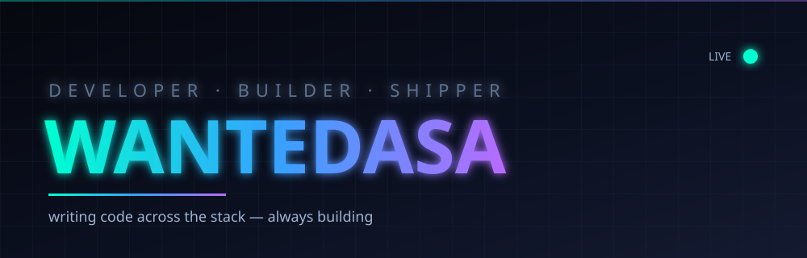

<!-- WANTEDASA — profile -->
<div align="center">



<br>


</div>

---

<table>
<tr>
<td width="55%">

### 👾 whoami

> **wantedasa** — developer.

I write code across the stack and build a bit of everything — web apps,
discord bots, small tools and whatever comes up. I like config-driven
design, clean structure and shipping things that actually work.

- 🔭 **Currently:** building things
- 🌱 **Learning:** wherever the next project takes me
- 💬 **Ask me about:** code, tooling, whatever I'm messing with
- ⚡ **Fun fact:** I'd rather configure it from one file than hardcode it

</td>
<td width="45%">

### 🛠️ stack


<br>

**focus**
```
general dev · web + discord
config-driven systems
whatever ships
```

</td>
</tr>
</table>

---

<div align="center">

### 📡 live on the grid


</div>

---

<div align="center">

### 🔗 connect

[](https://discord.gg/soon)
[](https://t.me/wantedasa)
[](https://soon)
[](mailto:soon)

</div>

---

<div align="center">

<sub>keep building</sub>

</div>
